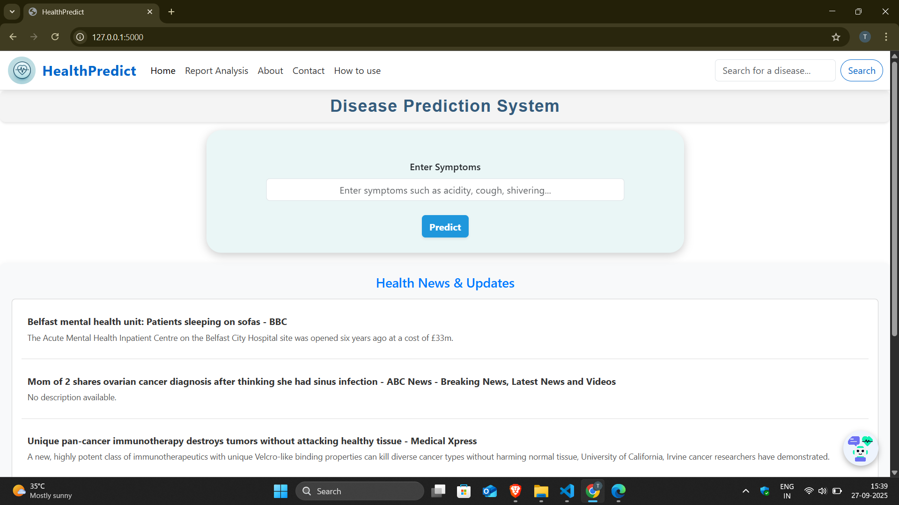
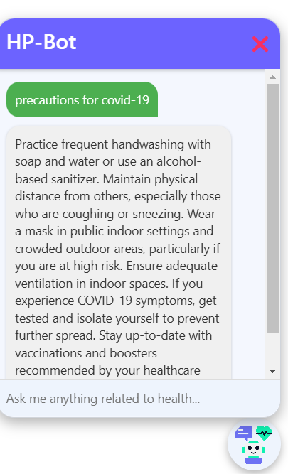
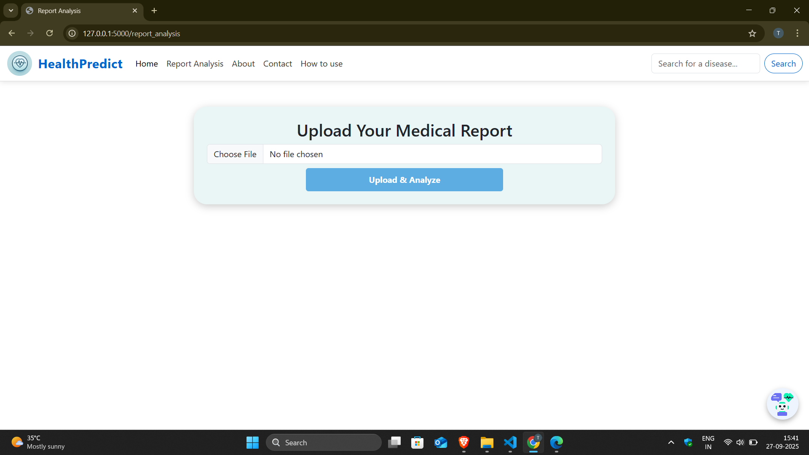
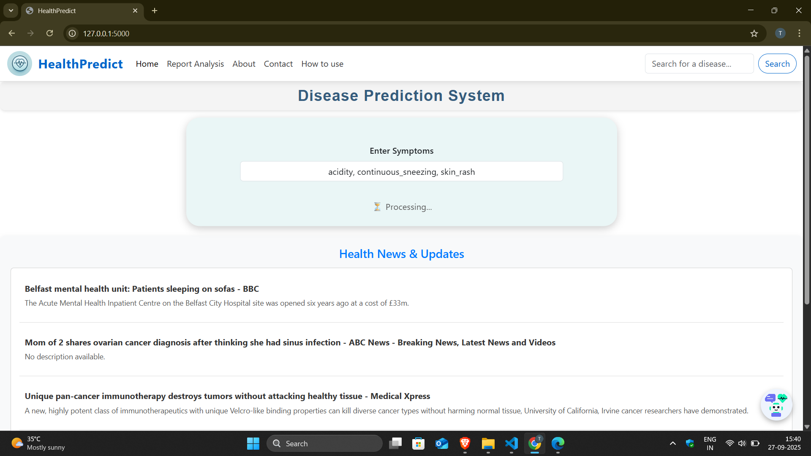
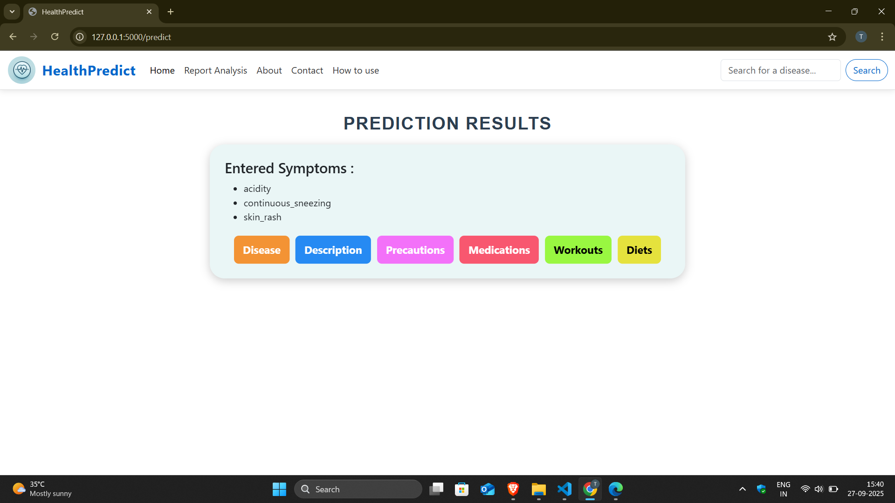
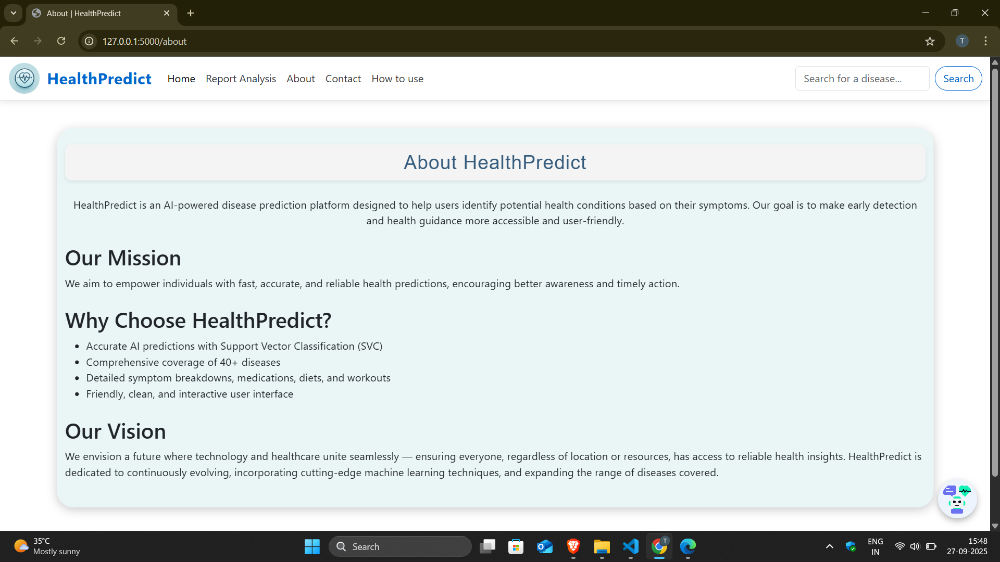
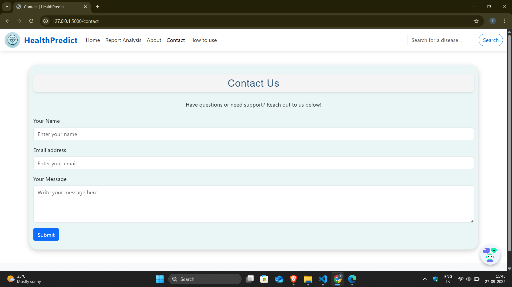
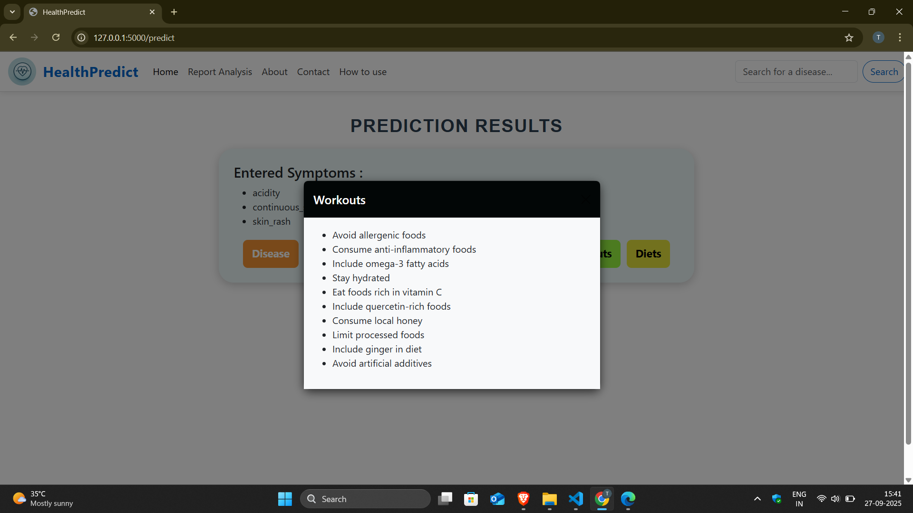
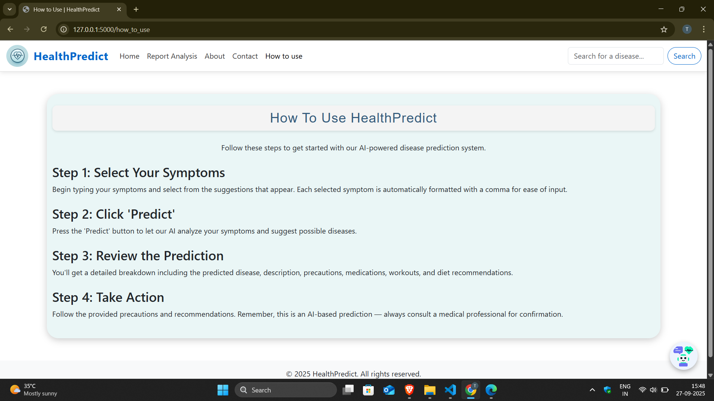
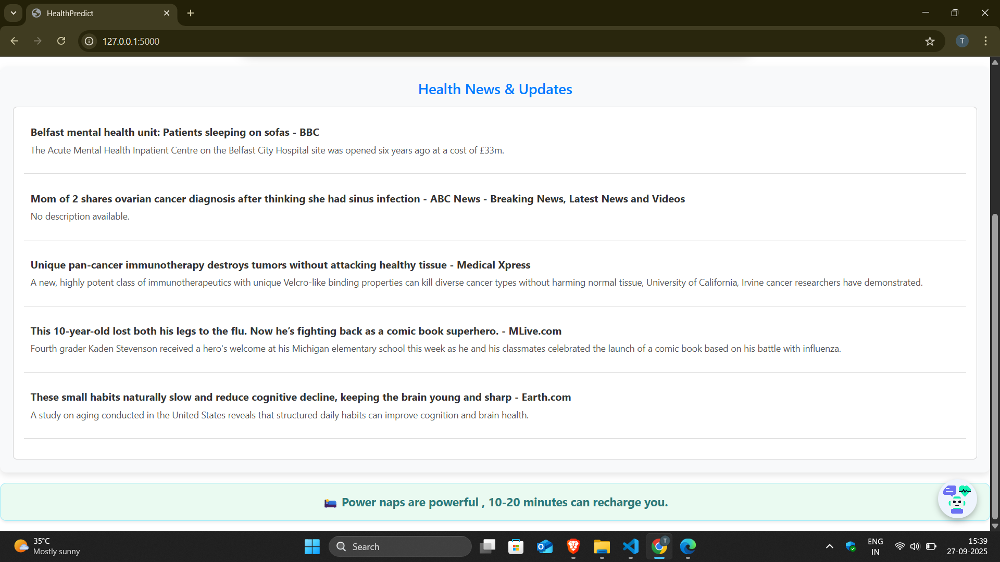

# 🩺 Disease Prediction System using Machine Learning

A full-stack AI-powered healthcare web application that predicts diseases based on symptoms and provides tailored health suggestions including medications, precautions, diets, workouts, news updates, and AI-driven tools like a medical chatbot and report analyzer.

---

## 🚀 Features

✅ **Disease Prediction** using symptoms  
✅ **100% accurate SVC Model**  
✅ **Precautions, Medications, Diets, Workouts** for predicted disease  
✅ **AI Medical Chatbot** (Gemini API)  
✅ **Medical Report Analyzer** (OCR + Gemini API)  
✅ **Live Health News Feed**  
✅ User-friendly UI using **HTML + Bootstrap**

---

## 🧠 Technologies Used

- **Python**
- **Machine Learning (SVC, Random Forest, KNN, etc.)**
- **Pandas, NumPy, Scikit-learn**
- **Tesseract OCR** – for text extraction from medical reports
- **Gemini API** – for AI chatbot & report summarization
- **Flask** – Backend framework
- **HTML, CSS, Bootstrap** – Frontend
- **JavaScript (Fetch/AJAX)** – API integrations

---

## 📊 ML Model

- Dataset: Preprocessed symptoms-to-disease dataset
- Classification Models Tried:
  - Support Vector Classifier (SVC)
  - Random Forest
  - K-Nearest Neighbors
  - Gradient Boosting
  - Multinomial Naive Bayes
- **SVC** selected (100% accuracy)
- Model saved using **Pickle** for fast loading

---

## 🧾 Project Modules

### 1. 🔍 Disease Prediction
Users input symptoms → Model predicts disease → Displays:
- Disease name
- Description
- Precautions (4)
- Medications (5)
- Workouts (10)
- Diets (5)

### 2. 🧠 AI Medical Chatbot
- Integrated via Gemini API
- Handles only **medical-related** queries
- Helps users get quick answers & explanations

### 3. 🧾 Medical Report Analyzer
- Upload medical report image (PNG, JPG)
- Extracts text using **Tesseract OCR**
- Sends to Gemini for **simplified summary**

### 4. 📰 Health News Section
- Live health headlines using **News API**
- Updated regularly with trustworthy news sources

---

## 📸 Project Preview

### 🏠 Home Page

### 🤖 AI Chatbot

### 📑 Medical Report Analyzer

### 🏥 Symptom Input

### 📊 Results Display

### 📖 Project Overview

### 📧 Reach Out

### 🦠 Disease Information

### 🧭 User Guide

### 🗞 Live Updates

### 🔍 Search Feature

---
